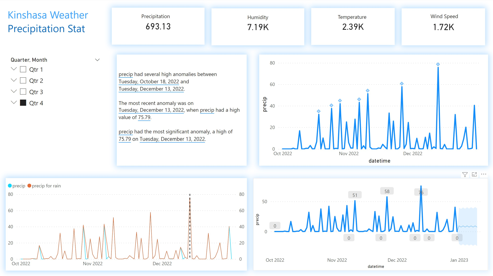
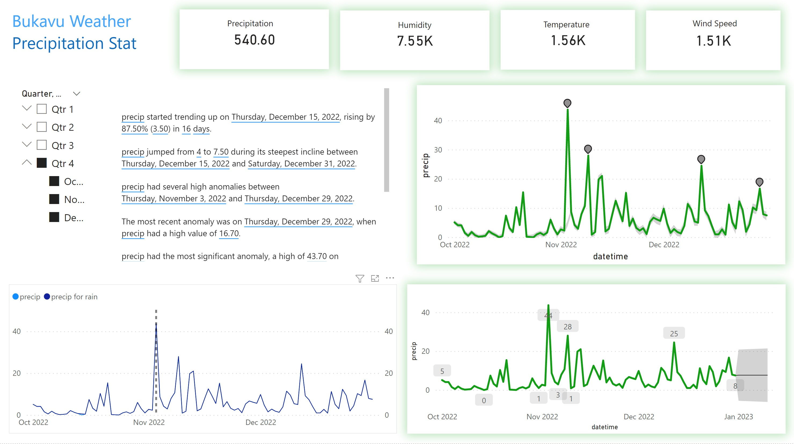

# Kinshasa and Bukavu-weather-anomaly-detection
 ------------------------------------------------
Raining fall has caused disaster in Kinshasa & in Bukavu, cars washed away, houses and road destroyed some people have been lost during that catastrophe. Accross that event we will get an insight of weather data, finding anomalies and how to prevent that situation with artificial intelligence accross Power BI   
## Database which is locate at Data folder
Click this Data folder to view the data that was been used through the workshop 

## Kinshasa Weather
 

 ##
 
## Bukavu Weather
 
 

## Link for the Dasheboard and reports
[Weather Analysis ](https://app.powerbi.com/view?r=eyJrIjoiYzcyMmM5MDItNTNhNC00NTIzLWEwYjItYThiMzNkZjMwOTc0IiwidCI6ImQyMzViNDFjLTVlZTktNGM2MC1iY2ZmLWQ2OGZlM2JmZjZhMCIsImMiOjN9)
## Slides
 
[PowerPoint](Financial%20Sample%20PPT.pptx)
